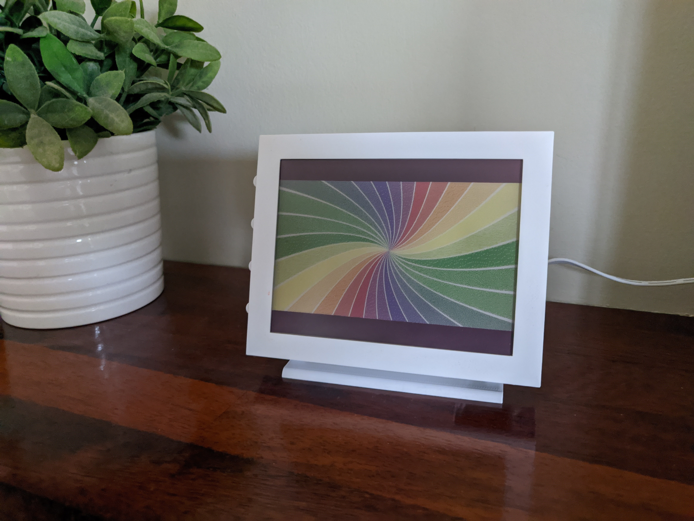

# SlowMovieInColor

<!--  -->

## An Adaption of Tom Whitwell's SlowMovie Player to work with the Inky Impression

Original writeup of Tom's project: 
https://medium.com/@tomwhitwell/how-to-build-a-very-slow-movie-player-in-2020-c5745052e4e4

The Inky Impression: 
https://shop.pimoroni.com/products/inky-impression

This is an adapted version of the SlowMovie player to work with the Inky Impression, a 7 color e-ink display made by Pimoroni. The project uses a Raspberry Pi Zero W as the brains of the operation which so far in testing works well. The project requires the use of the Inky python library which can be found [here](https://github.com/pimoroni/inky). The case that can be seen in the image above is Scripsi's Inky Impression Case which can be found [here](https://github.com/scripsi/inky-impression-case).

## Note

Currently this is a work in progress so no guarantees can be made about its functionality.

